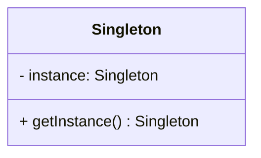

# Singleton
## Introdução
O Singleton é um padrão de projeto criacional que garante que uma classe tenha apenas uma instância e fornece um ponto de acesso global a ela. <br><br>É amplamente usado para:

* Gerenciar conexões de banco de dados
* Configurações globais
* Loggers
* Caches

## Funcionamento do Singleton
Princípios Básicos
* Construtor privado → Impede a criação de novas instâncias externamente.
* Método estático getInstance() → Controla o acesso à instância única.
* Instância armazenada estaticamente → Garante que só exista uma cópia.



## Exemplo Prático em C#
### Problema: Gerenciando um serviço SEM Singleton

`ICounterService.cs`
```
public interface ICounterService
{
    int Value { get; }
    void Increment();
}
```
`CounterService.cs`
```
public class CounterService : ICounterService
{
    private int _count = 0;

    public int Value => _count;

    public void Increment()
    {
        _count++;
    }
}
```
`CounterController.cs`
```
public class CounterController : ControllerBase
{
    private readonly ICounterService _counterService;

    public CounterController()
    {
        _counterService = new CounterService(); // Cada chamada cria nova instância
    }

    [HttpGet("increment")]
    public IActionResult Increment()
    {
        _counterService.Increment();
        return Ok($"Contador atual: {_counterService.Value}");
    }
}
```

### Solução: Implementando Singleton com ASP.NET Core DI

`ICounterService.cs`
```
// Inalterado
public interface ICounterService
{
    int Value { get; }
    void Increment();
}
```
`CounterService.cs`
```
// Inalterado
public class CounterService : ICounterService
{
    private int _count = 0;

    public int Value => _count;

    public void Increment()
    {
        _count++;
    }
}
```
`ServiceCollectionExtensions.cs`
```
// Metodos de extensao
using Microsoft.Extensions.DependencyInjection;

public static class ServiceCollectionExtensions
{
    public static IServiceCollection AddMyServices(this IServiceCollection services)
    {
        // .NET cria e armazena uma única instância, além de realizar a injeção de dependêcia
        services.AddSingleton<ICounterService, CounterService>();

        return services;
    }
}
```

#### Por de baixo dos panos, ocorre algo assim
```
// Diferentemente de do Singleton tradicional, nao ha necessidade de um construtor privado -> .NET
private static T _instance;
public T GetInstance()
{
    if (_instance == null)
    {
        _instance = new T();
    }
    return _instance;
}
```

`Startup.cs`
```
// Outro design pattern: Builder
var builder = WebApplication.CreateBuilder(args);

builder.Services.AddControllers();
builder.Services.AddMyServices();

var app = builder.Build();

app.UseRouting();
app.UseEndpoints(endpoints =>
{
    endpoints.MapControllers();
});
```

`CounterController.cs`
```
public class CounterController : ControllerBase
{
    private readonly ICounterService _counterService;

    public CounterController(ICounterService counterService)
    {
        _counterService = counterService; // Mesma instância para toda a aplicação
    }

    [HttpGet("increment")]
    public IActionResult Increment()
    {
        _counterService.Increment();
        return Ok($"Contador atual: {_counterService.Value}");
    }
}
```

### Pontos Fortes e Fracos
#### Pontos Fortes
* Controle estrito sobre a instância única.
* Economia de memória (evita recriação desnecessária).
* Acesso fácil de qualquer parte do código.

#### Pontos Fracos
* Dificulta testes unitários (estado global pode causar efeitos colaterais).
* Pode mascarar más práticas (excesso de dependências globais).
* Não é thread-safe em todas as linguagens (em JS/TS, isso não é um problema devido à single-thread nature).

### Conclusão
O Singleton é útil para cenários onde um único ponto de controle é necessário, mas deve ser usado com moderação para evitar:
* Acoplamento excessivo
* Dificuldades na manutenção

### Referências
[Refactoring Guru - Singleton](https://refactoring.guru/pt-br/design-patterns/singleton)<br>
Slides de aula